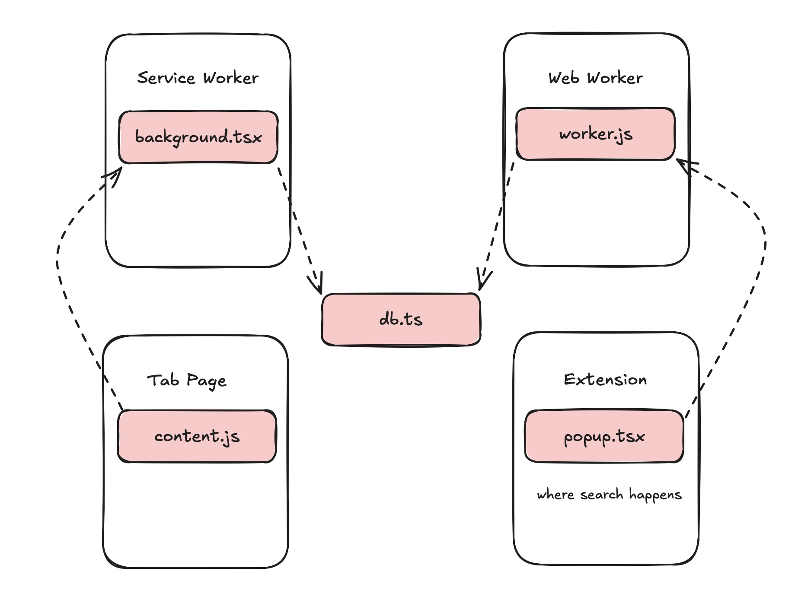

# What and how?

👻 Casper is your friendly neighbourhood extension, grabbing the contents of the sites you visit, chunking it, generating its embedding representations and storing them in a Postgres wasm living in the browser. In fact, everything in Casper is performed fully in-browser.
Nothing leaves your browser, no API calls at all, other than to download the encoder-only model it needs to generate the learned representations of the chunked contents.

# Setting up the dependencies

### `electric-sql/pglite`

`casper` uses postgres wasm in the browser, and we need its distribution bundled together. You can head over to their [repo](https://github.com/electric-sql/pglite?tab=readme-ov-file#how-to-build-pglite-and-contribute).

1. Find their latest PR, go to the comments, and download the file in the link for `PGlite`.
2. Untar the downloaded file. Its contents should look like:

```
package/
    dist/
    LICENSE
    package.json
    README.md
```
3. Rename `dist/` to `electric-sql`.
4. Create a new directory named `dist/` in the root directory of `casper/`.
5. Copy and paste the renamed directory `electric-sql/` into `dist/`.

Your final directory structure should look something like:

```
casper/
    components/
    ...
    dist/
        electric-sql/
    ...
    README.md
```

### Building the extension

There's a weird issue where the plasmo build process generates `_empty*.js` files when compiling the pglite dist bundle. These files present a problem when trying to load unpacked in a Chrome extension.
I added a script `clean-empty.js` to remove these files during the build process. In `package.json`, this is: `plasmo build && node clean-empty.js`, abbreviated with:

```
    pnpm build
```

If you use `pnpm dev`, you'll need to remove the files yourself manually. But this only needs to be done once at the start - any subsequent updates to the code will trigger Plasmo to repackage the extension, but will not rebuild and therefore, not recreate new `_empty*.js` files.


# Browser Extensions Architecture

You will find this section interesting only if you'd like to better understand generally how to build browser extensions. This is something I'd like to have had when I first started working on Casper.



1. **Web worker**

Since javascript functions as a single-threaded event-loop, you'd think its performance in the browser is limited. Web workers enable running on a separate thread for browser applications by offloading compute-heavy applications to a background js worker, to prevent blocking of the main thread.
They are scoped to the current web page and/or script that created them, and not tied to the lifecycle of the Chrome extension. They're instantiated using `new Worker()` and remains active until terminated.

Crucially, they also don't have access to the DOM and most browser APIs. They communicate with the main thread via message passing (`postMessage`, `onmessage`).

With Casper, when the extension popup (`popup.tsx`) is opened by the user, it initializes a web worker in order to get a reference to the pglite instance and this instance is used to interact/read from the db. That is, it is the web worker that maintains the in-browser pglite connection.

2. **Service worker**

These workers are specific to extensions in manifest v3, and are used to handle extension-specific background tasks. Because they are event-driven, their lifecycles only last for the duration of the task they perform in response to the event, after which they're unloaded.

The service workers are found in `background.ts` and are responsible for generating the embeddings.

3. **Content page**

When a user opens a new web page, the content script is injected into the webpage and executes the script it contains (`content.tsx`). For Casper, this is reading the contents of the newly opened web page, parses its contents using the DOM tree, and generates chunks to be sent to the background service workers.

For any changes made to the postgres database, I found it necessary to wrap the db reference using the navigator's web lock API, because the data was getting corrupted and inconsistent between calls. If you experience this while using Casper, do let me know.

> The biggest issue I've found during Casper's development is the lack of [documented support for using pglite with browser extensions](https://github.com/electric-sql/pglite/issues/323).

# Future work
1. Improve chunking strategy
2. Reinject script on extension update to stop invalidated error notification
3. Add reranker to search results
4. Use a proper ORM + db migration
